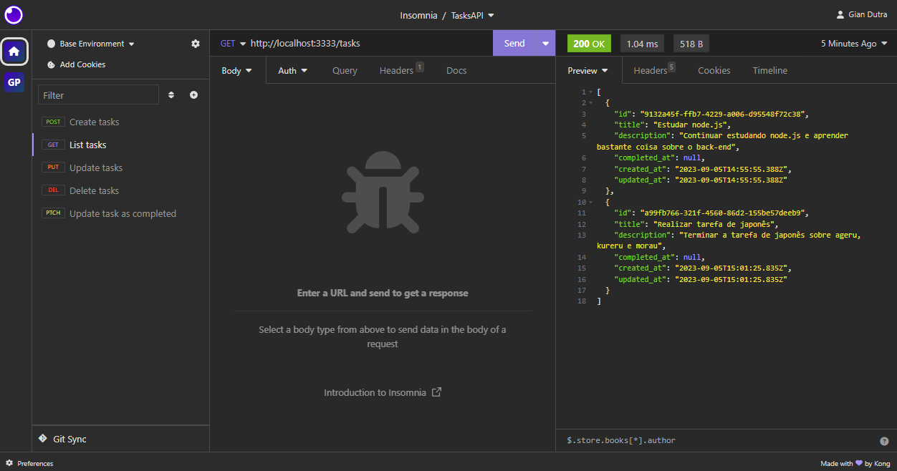

# TasksAPI-Challenge

<p align="center">
  

   <a href="https://github.com/GianDutra/TasksAPI-Challenge/commits/master">
    
  </a>
  
</p>



> Challenge completed as an exercise in the first module of Rocketseat's Node.js. In addition to the project requirements, I went further and implemented the extras as well.

## About the challenge

In this challenge you will develop an API to perform the CRUD of your *tasks* (tasks).

The API must contain the following functionality:

- Creating a task
- List of all tasks
- Update a task by `id`
- Remove a task by `id`
- Mark a task as complete by `id`
- And the real challenge: Importing tasks in bulk via a CSV file

### Routes and business rules

Before the routes, let's understand what structure (properties) a task should have:

- `id` - Unique identifier of each task
- `title` - Task title
- `description` - Detailed description of the task
- `completed_at` - Date when the task was completed. The initial value must be `null`
- `created_at` - Date when the task was created.
- `updated_at` - Must always be changed to the date when the task was updated.

Routes:

- `POST - /tasks`
    
     It should be possible to create a task in the database, sending the fields `title` and `description` through the `body` of the request.
    
     When creating a task, the fields: `id`, `created_at`, `updated_at` and `completed_at` must be filled in automatically, according to the orientation of the properties above.
    
- `GET - /tasks`
    
     It should be possible to list all tasks saved in the database.
    
     It should also be possible to perform a search, filtering tasks by `title` and `description`
    
- `PUT - /tasks/:id`
    
     It should be possible to update a task by `id`.
    
     In the `body` of the request, it should only receive the `title` and/or `description` to be updated.
    
     If only the `title` is sent, it means that the `description` cannot be updated and vice versa.
    
     Before carrying out the update, validation must be carried out if the `id` belongs to a task saved in the database.
    
- `DELETE - /tasks/:id`
    
     It should be possible to remove a task by `id`.
    
     Before carrying out the removal, a validation must be done if the `id` belongs to a task saved in the database.
    
- `PATCH - /tasks/:id/complete`

     It must be possible to mark the task as complete or not. This means that if the task is completed, it should return to its “normal” state.

     Before the alteration, a validation must be done if the `id` belongs to a task saved in the database.

## Going beyond

Some suggestions of what can be implemented (I implemented them):

- Validate whether the `title` and `description` properties of the `POST` and `PUT` routes are present in the `body` of the request.
- In routes that receive `/:id`, in addition to validating whether the `id` exists in the database, return the request with a message informing that the record does not exist.
## Tech Stack

- **[CSV](https://csv.js.org/)**
- **[NodeJS](https://nodejs.org)**

  
## 🚀 Testing my Tasks-API

 
```bash

# Clone this repository
$ git clone git@github.com:GianDutra/TasksAPI-Challenge.git

# Access the project folder in your terminal
$ cd TasksAPI-Challenge

# Install the dependencies
$ npm install

# Run the application in developer mode
$ npm run dev

# Access my API
To test the routes and interact with my API, you can use a tool like Insomnia or Postman. Follow these steps:

1. Open Insomnia or Postman on your computer.

2. Create a new request for each API route you want to test (e.g., POST, GET, PUT, DELETE, PATCH).

3. Set the request URL to http://localhost:3333, which is the default address where your API should be running.

4. Configure the request method and add any required headers or request body parameters according to the route you want to test.

```

---


## 👨‍💼 Author

<table>
  <tr>
    <td align="center">
      <a href="#">
        <br>
        <sub>
          <b>Gian Dutra</b>
        </sub>
      </a>
    </td>
  </tr>
</table>
